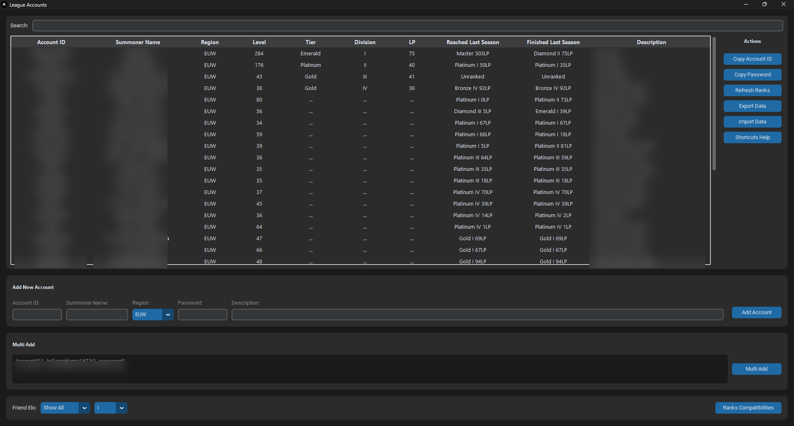

# LeagueAccounts

**LeagueAccounts** helps you manage multiple **League of Legends** accounts from one Windows app, with secure password storage, quick login helpers, and automatic rank updates.



## Features

- **Quick Account Switching**: Keep all accounts in one list.
- **Secure Password Storage**: Store credentials with Windows Credential Manager.
- **Auto Credential Entry**: Use `CTRL+SHIFT+V` to fill Riot Client login fields.
- **Automatic Rank Updates**: Fetch rank, last-season ranks, and level.
- **Import / Export**: Move account data between installs.

## Installation

[Download the latest release](https://github.com/FlorentTariolle/LeagueAccounts/releases/latest).

## Building from Source

```bash
# Install dependencies
pip install -r requirements.txt

# Build executable
python scripts/build_exe.py
```
